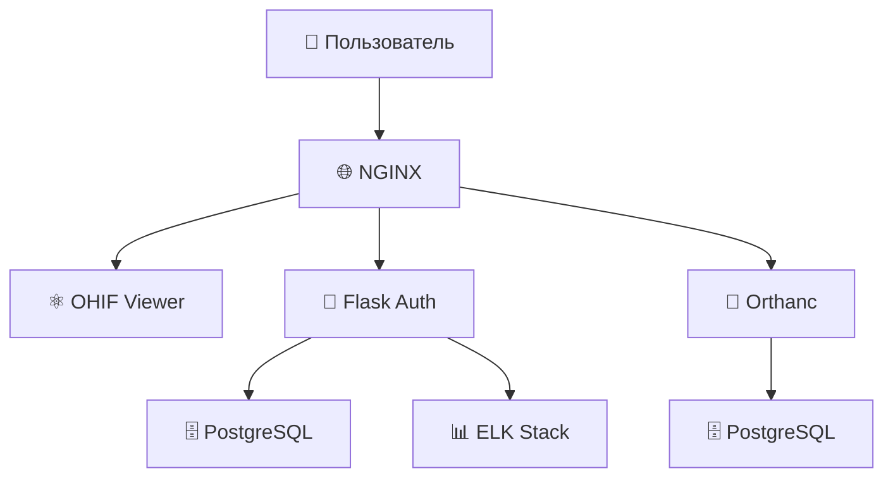

<div align="center">

# 🏥 Clinton Medical PACS

**Профессиональная система архивирования и передачи медицинских изображений**

[](LICENSE)
[](docker-compose.yml)
[](https://www.dicomstandard.org/)
[](https://ohif.org/)

*Современная PACS система на основе микросервисной архитектуры с веб-интерфейсом для управления DICOM изображениями, отчетами и пациентами.*

</div>

## 📸 Скриншоты

### 🔐 Система входа


### 📋 Список исследований


### 🖼️ OHIF Viewer с отчетами


### 🌍 Выбор языка


### 📄 Экспорт в PDF


### 🏗️ Архитектура системы


## 🚀 Быстрый старт

```bash
# Клонировать репозиторий
git clone https://github.com/your-repo/clinton-medical-pacs.git
cd clinton-medical-pacs

# Запустить систему
docker-compose up -d

# Инициализировать базу данных
docker-compose exec flask_auth_service python init_db.py
```

**🌐 Доступ к системе:**
- **Веб-интерфейс**: https://localhost
- **Логин**: `admin` / `admin`
- **OHIF Viewer**: https://localhost/ohif
- **Orthanc**: https://localhost/orthanc

## ✨ Основные функции

<table>
<tr>
<td width="50%">

### 📁 Управление данными
- 🔍 **Поиск исследований** - быстрый поиск по пациентам
- 📤 **Загрузка DICOM** - drag & drop интерфейс
- 👥 **Управление пациентами** - полная CRM система
- 📊 **Статистика** - отчеты по использованию

</td>
<td width="50%">

### 🖼️ Просмотр изображений
- 🔬 **OHIF Viewer** - современный просмотрщик
- 📏 **Измерения** - линейки, углы, площади
- 🎨 **Аннотации** - текстовые заметки
- 🔄 **MPR** - мультипланарная реконструкция

</td>
</tr>
<tr>
<td width="50%">

### 📋 Система отчетов
- ✍️ **Редактор отчетов** - встроенный WYSIWYG
- 📄 **Экспорт PDF** - отчеты с изображениями
- 📝 **Шаблоны** - готовые формы отчетов
- 🔄 **Версионность** - история изменений

</td>
<td width="50%">

### 🔐 Безопасность
- 👤 **Ролевая модель** - админы, врачи, операторы
- 🔒 **HTTPS** - защищенное соединение
- 🛡️ **Аутентификация** - JWT токены
- 📝 **Аудит** - логирование действий

</td>
</tr>
</table>

## 🏗️ Архитектура



### 🔧 Компоненты:

| Сервис | Описание | Порт |
|--------|----------|------|
| **NGINX** | Реверс-прокси, SSL | 80, 443 |
| **OHIF Viewer** | Просмотрщик DICOM | 3000 |
| **Flask Auth** | API, аутентификация | 5000 |
| **Orthanc** | DICOM сервер | 8042 |
| **PostgreSQL** | База данных | 5432 |

## 📋 Требования

- **Docker** и **Docker Compose**
- **RAM**: 8+ ГБ
- **Диск**: 100+ ГБ
- **CPU**: 2+ ядра

## 🛠️ Основные команды

```bash
# Запуск
docker-compose up -d

# Статус
docker-compose ps

# Логи
docker-compose logs -f

# Остановка
docker-compose down

# Инициализация БД
docker-compose exec flask_auth_service python init_db.py
```

## 🔧 Настройка

### SSL сертификат
```bash
./scripts/generate_ssl.sh
docker-compose restart nginx
```

### Смена паролей
```bash
cp env.example .env
nano .env  # Отредактировать пароли
docker-compose restart flask_auth_service
```

## 📊 Использование

1. **Добавить пациента**: Пациенты → Добавить
2. **Загрузить DICOM**: Исследования → Загрузить
3. **Просмотр**: Кликнуть на исследование → OHIF Viewer
4. **Отчет**: В просмотрщике → Создать отчет → Экспорт PDF

## 🆘 Устранение проблем

```bash
# Порты заняты
sudo netstat -tlnp | grep :80
sudo systemctl stop apache2 nginx

# Недостаточно памяти
docker stats
sudo fallocate -l 4G /swapfile && sudo swapon /swapfile

# Ошибки БД
docker-compose restart postgres
docker-compose logs postgres
```

## 🛡️ Безопасность

- Смените пароли по умолчанию
- Используйте SSL в продакшн
- Регулярно обновляйте систему
- Настройте файрвол

---

**License**: MIT | **Version**: 2.0 | **Поддержка**: GitHub Issues