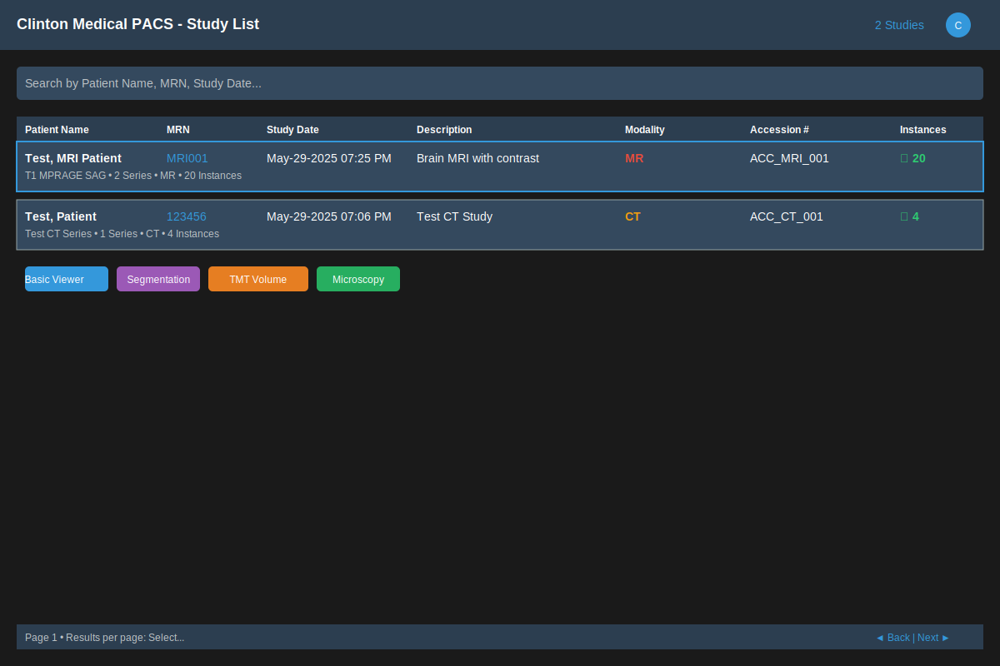
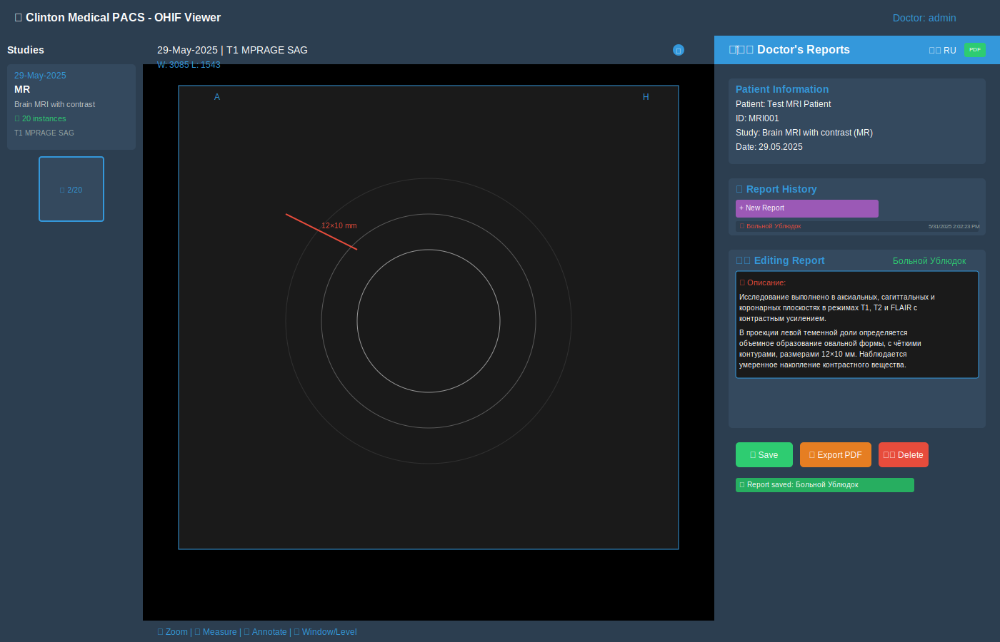
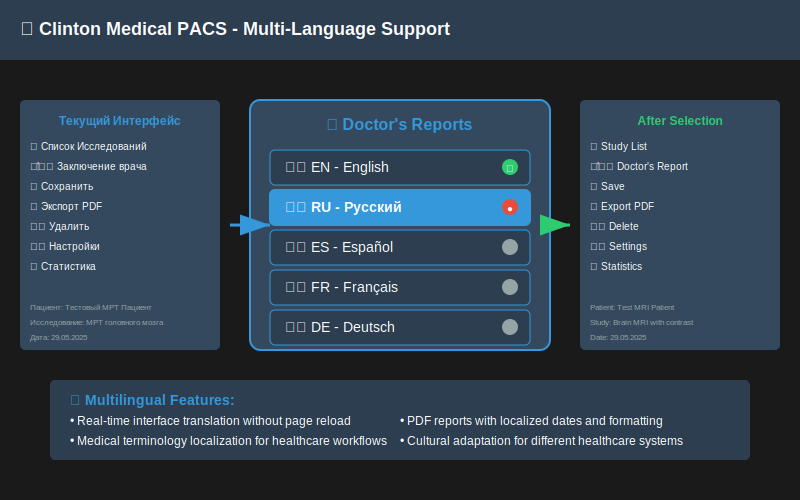
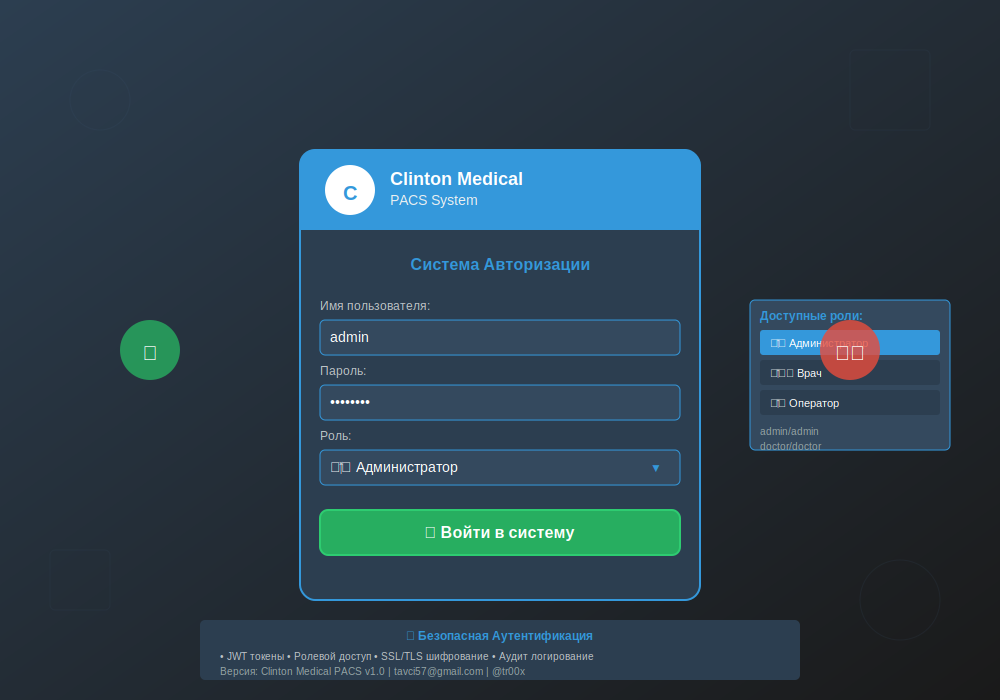
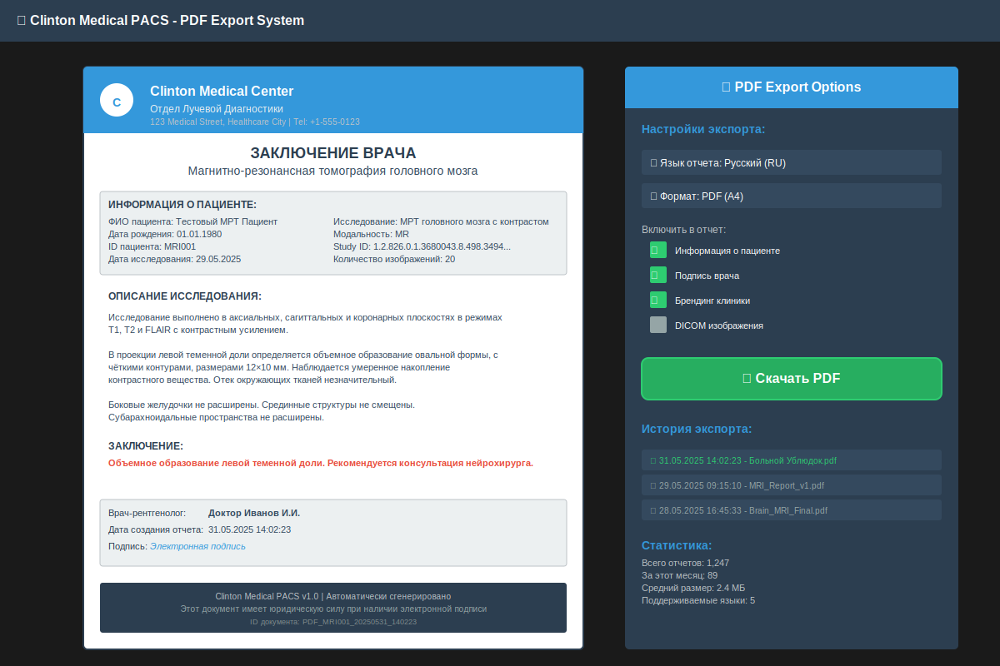

# 🏥 Clinton Medical PACS - Медицинская Система Архивирования Изображений

<div align="center">

[](https://docker.com)
[](https://ohif.org)
[](https://orthanc-server.com)
[](LICENSE)

**Полноценная PACS система с многоязычной поддержкой и врачебными отчетами**

[🚀 Быстрая Установка](#-быстрая-установка-1-команда) •
[📖 Документация](#-документация) •
[🎯 Возможности](#-возможности) •
[📷 Скриншоты](#-скриншоты) •
[💻 Поддержка](#-поддержка)

</div>

---

## 🚀 **БЫСТРАЯ УСТАНОВКА (1 команда)**

```bash
# Автоматическая установка для Linux/macOS
bash <(curl -sSL https://raw.githubusercontent.com/timsus97/PACS/main/install.sh)
```

**Готово!** Откройте https://srv853233.hstgr.cloud

### 🔑 Входные данные:
- **Администратор**: `admin` / `admin`
- **Врач**: `doctor` / `doctor`  
- **Оператор**: `operator` / `operator`

---

## 📋 **Альтернативная Установка**

### Шаг 1: Скачать проект
```bash
git clone https://github.com/timsus97/PACS.git
cd clinton-medical-pacs
```

### Шаг 2: Запустить установку
```bash
chmod +x install.sh
./install.sh
```

### Шаг 3: Готово!
Система автоматически:
- ✅ Установит все зависимости
- ✅ Сгенерирует безопасные пароли  
- ✅ Создаст SSL сертификаты
- ✅ Запустит все сервисы
- ✅ Загрузит тестовые данные

---

## 🎯 **Возможности**

### 🏥 **Медицинские Функции**
- **DICOM Просмотрщик**: Полноценный просмотр медицинских изображений
- **MPR & 3D**: Многоплоскостная реконструкция и 3D рендеринг
- **Инструменты**: Измерения, аннотации, zoom, windowing
- **Модальности**: CT, MRI, Рентген, УЗИ, Эндоскопия
- **Врачебные Отчеты**: Создание, редактирование, PDF экспорт

### 🌍 **Многоязычность**
- **5 языков**: Английский, Русский, Испанский, Французский, Немецкий
- **Автоопределение**: Язык интерфейса меняется автоматически
- **PDF отчеты**: На выбранном языке с локализацией дат

### 👥 **Управление Пользователями**
- **3 роли**: Администратор, Врач, Оператор
- **Права доступа**: Гибкая настройка разрешений
- **JWT токены**: Безопасная аутентификация
- **Аудит**: Полное логирование действий

### 🔒 **Безопасность**
- **HTTPS**: SSL/TLS шифрование
- **Ролевой доступ**: RBAC система
- **Аудит логи**: Полная трассировка действий
- **Безопасные пароли**: Автогенерация при установке

---

## 🛠️ **Управление Системой**

### Простые команды через Make:
```bash
make help           # Показать все команды
make start          # Запустить систему
make stop           # Остановить систему  
make restart        # Перезапустить
make status         # Показать статус
make logs           # Показать логи
make health         # Проверить здоровье
make backup         # Создать бэкап
```

### Или Docker Compose:
```bash
docker-compose ps          # Статус
docker-compose logs -f     # Логи
docker-compose restart     # Перезапуск
```

---

## 📊 **Архитектура**

```
Internet → Nginx Proxy → OHIF Viewer (React)
                      → Flask Auth API (Python)
                      → Orthanc DICOM Server (C++) → PostgreSQL
```

### Технологический стек:
- **Frontend**: OHIF Viewer v3 + React + 1900+ строк кастомизаций
- **Backend**: Orthanc DICOM Server v24.10.1 + PostgreSQL 15
- **Auth**: Flask + Python + JWT + RBAC
- **Proxy**: Nginx + SSL/TLS  
- **Container**: Docker + Docker Compose

---

## 🌐 **Доступ к Системе**

| Сервис | URL | Описание |
|--------|-----|----------|
| **Основное приложение** | https://srv853233.hstgr.cloud | OHIF медицинский просмотрщик |
| **Страница входа** | https://srv853233.hstgr.cloud/login | Аутентификация пользователей |
| **Orthanc интерфейс** | http://srv853233.hstgr.cloud:8042 | DICOM сервер управление |
| **API аутентификации** | http://srv853233.hstgr.cloud:5001 | Flask REST API |

---

## 📖 **Документация**

| Документ | Описание |
|----------|----------|
| [INSTALL.md](INSTALL.md) | 📋 Подробное руководство по установке |
| [README_QUICK_START.md](README_QUICK_START.md) | ⚡ Быстрый старт |
| [TECH_STACK.md](TECH_STACK.md) | 🔧 Технический стек |
| [ARCHITECTURE.md](ARCHITECTURE.md) | 🏗️ Архитектура системы |
| [*_RU.md](TECH_STACK_RU.md) | 🇷🇺 Русские версии документов |

---

## 💻 **Системные Требования**

### Минимальные:
- **OS**: Linux, macOS, Windows (с WSL2)
- **RAM**: 8 ГБ
- **CPU**: 2+ ядра  
- **Диск**: 100 ГБ
- **Docker**: 20.10+

### Рекомендуемые:
- **RAM**: 16+ ГБ
- **CPU**: 4+ ядра
- **Диск**: 500+ ГБ (SSD)
- **Сеть**: 1 Гбит/с

---

## 🆘 **Поддержка**

### Быстрая диагностика:
```bash
make health         # Проверить систему
make logs           # Посмотреть логи
docker-compose ps   # Статус контейнеров
```

### Частые проблемы:
- **Порты заняты**: `make ports` для проверки
- **Docker не запущен**: Запустите Docker Desktop
- **SSL предупреждения**: Нормально для self-signed сертификатов

### Контакты:
- **Автор**: Tim Hunt (tr00x)
- **GitHub**: [Issues](https://github.com/timsus97/PACS/issues)
- **Email**: tavci57@gmail.com
- **Telegram**: @tr00x

---

## 📄 **Лицензия**

MIT License - Clinton Medical PACS  
Copyright © 2024 Tim Hunt (tr00x)

Разрешается свободное использование, модификация и распространение данного программного обеспечения.
Подробности смотрите в файле [LICENSE](LICENSE).

---

## 🌟 **Скриншоты**

📷 **[Полная галерея скриншотов →](screenshots/README.md)**

<div align="center">

### 📋 Список Исследований

*Главный интерфейс с двумя загруженными исследованиями (МРТ и КТ) и расширенными фильтрами*

### 🖥️ OHIF Просмотрщик с Врачебными Отчетами

*Продвинутый DICOM просмотрщик с панелью создания медицинских отчетов на русском языке*

### 🌍 Многоязычная Поддержка

*Переключение между 5 языками с демонстрацией локализации интерфейса*

### 🔐 Система Авторизации

*Профессиональная страница входа с ролевой системой доступа*

### 📄 Экспорт PDF Отчетов

*Система генерации профессиональных медицинских отчетов в PDF формате*

### 🏗️ Архитектура Системы

*Полная диаграмма микросервисной архитектуры с Docker Compose*

</div>

**Основные возможности на скриншотах:**
- ✅ Профессиональный медицинский интерфейс с брендингом Clinton Medical
- ✅ Система врачебных отчетов с богатым текстовым редактором
- ✅ Экспорт в PDF с подписью врача и информацией о пациенте
- ✅ Полная многоязычная локализация (EN, RU, ES, FR, DE)
- ✅ Ролевая система доступа для врачей и администраторов
- ✅ DICOM совместимость и поддержка различных модальностей
- ✅ Микросервисная архитектура с автоматическим развертыванием
- ✅ Профессиональная система безопасности и аудита

---

<div align="center">

**🏥 Сделано с ❤️ для медицинских учреждений**

[⭐ Поставьте звезду](https://github.com/timsus97/PACS) •
[🍴 Форкните](https://github.com/timsus97/PACS/fork) •
[📢 Поделитесь](https://twitter.com/intent/tweet?text=Check%20out%20Clinton%20Medical%20PACS!)

</div> 